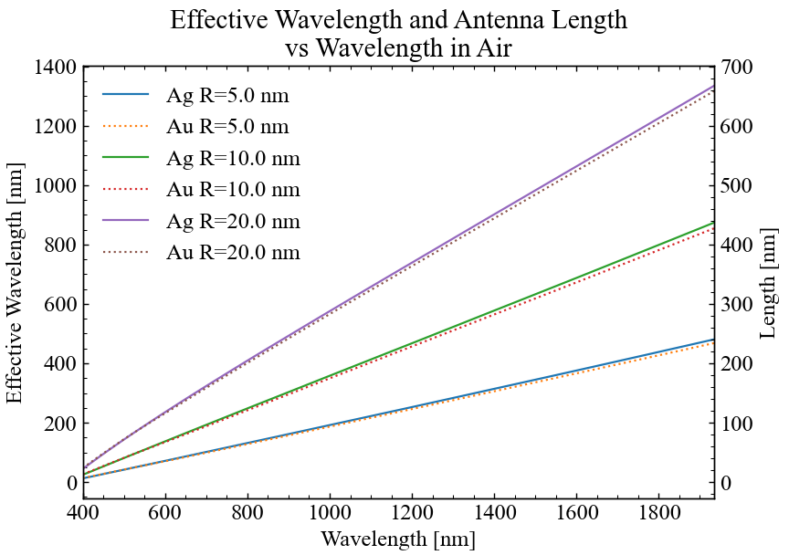

# MEEP plasmonic antennas

This repository contains the design and simulation files for plasmonic antennas using MEEP.

## Overview
A split-bar or bow-tie antenna design with electromagnetic simulations and analysis.

> **Note:** This project is currently a work in progress.

## Simulations

### Cell Structure

### Antenna Enhancement Effect

### EM Field

## Getting Started
Clone the repository and explore the simulation files to get started with the antenna design.

## Analytical calculations for half-wave dipole nanoantennas
Based on Novotny L.'s publication, *Effective wavelength scaling for optical antennas* (Phys Rev Lett. 2007 doi: https://doi.org/10.1103/PhysRevLett.98.266802), a script was created at:

> utils/novotny2007_effective_wavelength/

that allows one to calculate the half-wavelength of a dipole antenna and the effective wavelength for gold and silver.

