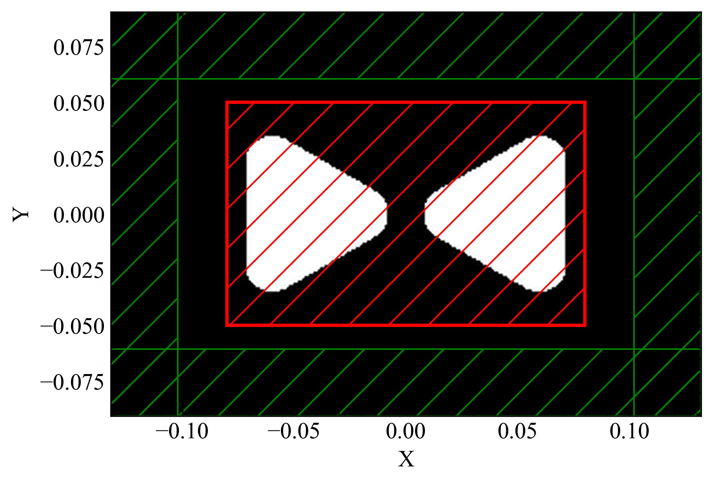
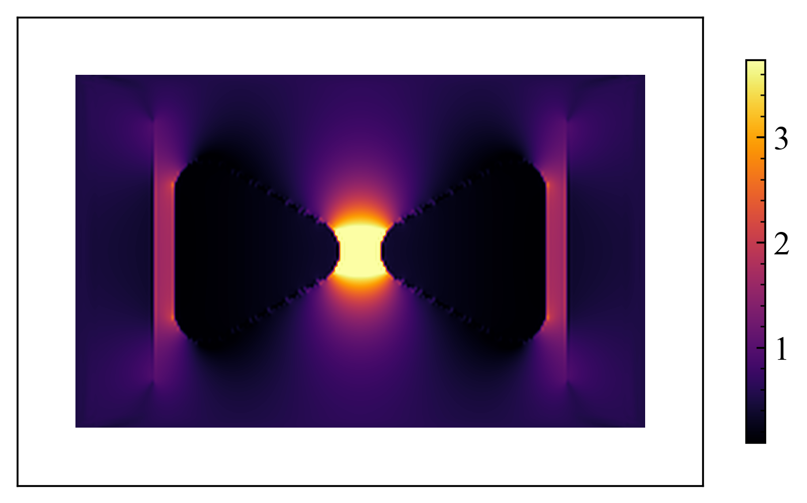

# MEEP plasmonic antennas

This repository contains the design and simulation files for plasmonic antennas using MEEP.

## Overview
A split-bar or bow-tie antenna design with electromagnetic simulations and analysis.

> **Note:** This project is currently a work in progress.

## Simulations

### Cell Structure

### Antenna Enhancement Effect

### EM Field

## Getting Started
Clone the repository and explore the simulation files to get started with the antenna design.

