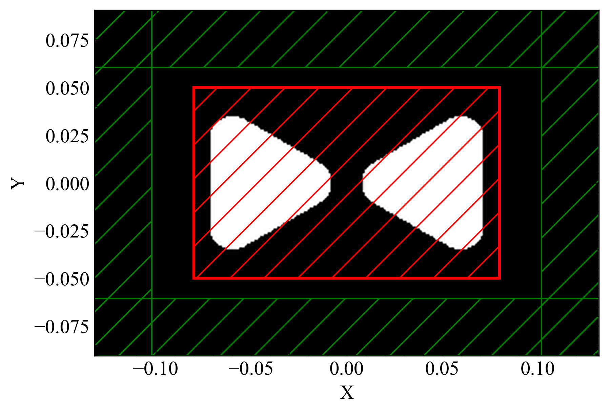
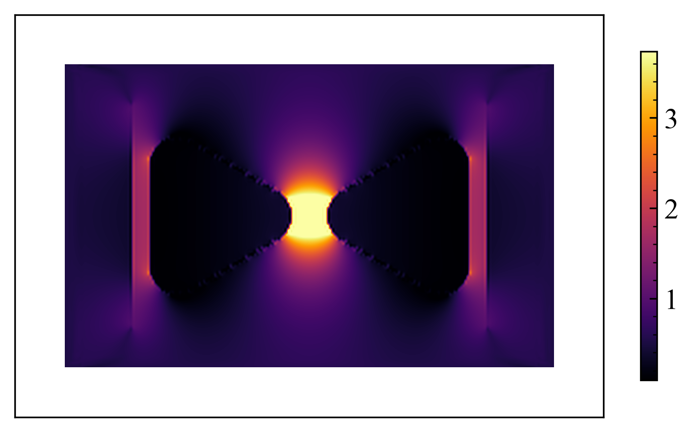
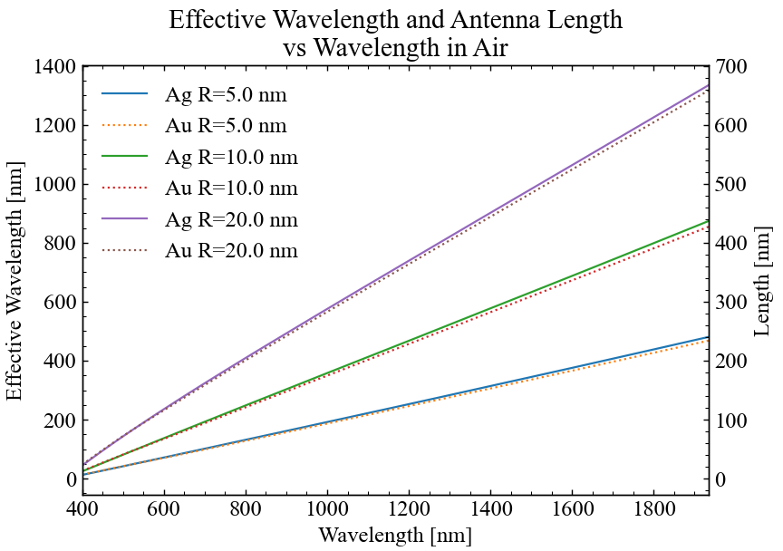

# MEEP Plasmonic Antennas

This repository contains a modular framework for designing, generating, and simulating plasmonic nanoantennas using MEEP.

The project has evolved from a single bow-tie example into a flexible geometry + simulation pipeline supporting multiple antenna types, parametric modeling, and post-processing.

---

## Overview

The goal of this project is to:

- Define parametric antenna geometries
- Convert them into MEEP-compatible structures
- Run electromagnetic simulations
- Analyze near-field enhancement and spectral response

The framework separates:
- **geometry definition**
- **simulation setup**
- **post-processing**

---

## Simulation Pipeline

## TL;DR

```
Parameters → Geometry → Cell → Source → Volumes
        → Simulation (full + empty)
        → Field computation
        → Raw visualization
        → Postprocessing (enhancement)
        → Outputs
```

---

This modular pipeline allows:

* easy parameter sweeps
* geometry swapping
* reproducible simulations
* consistent postprocessing

---

The simulation workflow is defined in `main/src/experiments.py` and executed via `main/run.py`.

A typical run follows the steps below:

---

### 1. Configuration Initialization

```python
config = SimulationConfig()
```

Defines global simulation parameters:

* resolution
* PML thickness
* padding
* symmetries
* output paths

---

### 2. Parameter Sweep

Simulations are typically executed in loops:

```python
for gap in [...]:
```

* enables automated studies (e.g. gap-dependent enhancement)
* each iteration creates a separate simulation directory

---

### 3. Geometry Construction

Antennas and layers are defined as objects:

```python
AuTop = SplitBar(...)
TiBetween = SplitBar(...)
substrate = Bar(...)
```

Then converted to MEEP geometry:

```python
geometry = (
    AuTop.build_geometry() +
    TiBetween.build_geometry() +
    substrate.build_geometry()
)
```

---

### 4. Simulation Cell Setup

The computational domain is defined:

```python
config.cell_size = [...]
cell = make_cell(config)
```

Includes:

* antenna size
* padding (`pad`)
* absorbing layers (`PML`)

---

### 5. Source Definition

Plane-wave source:

```python
config.src_size = [...]
config.src_center = [...]
```

Then created via:

```python
make_source(config)
```

---

### 6. Volume Definition (Probing Regions)

```python
antenna_vols = VolumeSet(cell, antenna=AuTop, top_z=...)
```

Defines:

* 2D planes (XY, XZ, YZ)
* 3D sampling regions
* regions of interest (ROI)

---

### 7. Configuration Logging

```python
save_and_show_config(config, [...])
```

* saves simulation parameters
* logs geometry setup
* ensures reproducibility

---

### 8. Simulation Initialization

Two simulations are created:

```python
sim = mp.Simulation(...)        # with geometry
sim_empty = mp.Simulation(...) # reference (no geometry)
```

Purpose:

* `sim` → actual fields
* `sim_empty` → normalization / baseline

---

### 9. Geometry Visualization (Pre-run)

```python
save_2D_plot(...)
```

Generates:

* XY / XZ / YZ projections
* quick sanity check of geometry

---

### 10. Field Computation

```python
compute_fields(sim, sim_empty, antenna_vols, config)
```

Core step:

* runs time-domain simulation
* records:

  * E-fields
  * energy density (D·E/2)
  * enhancement (E²)
* compares with empty simulation

---

### 11. Raw Field Animations

```python
animate_raw_fields(config, mode="BOTH")
```

* creates time-dependent field animations
* useful for debugging wave propagation

---

### 12. Postprocessing (Enhanced Fields)

```python
animate_enhancement_fields(config, draw_params=...)
```

* generates:

  * enhancement maps
  * zoomed regions (ROI)
  * final visual outputs

Custom parameters:

* zoom levels
* regions of interest (gap, hotspot)
* plane-specific visualization

---

### 13. Output Structure

Each simulation produces:

* field data (HDF5)
* 2D projections (PNG)
* animations (GIF / sequences)
* enhancement maps
* logged configuration

---

## Available Geometries

The framework supports multiple parametric antenna geometries. All geometries inherit from a common `AntennaBase` and implement:

- `build_geometry()` → returns MEEP objects
- `bounding_box()` → returns simulation size estimate

---

### BowTie

Classic bow-tie antenna defined by independent length and width.

**Parameters:**
- `gap`, `length`, `width`, `thickness`
- `radius` (optional rounding)
- `center`, `z_offset`

**Notes:**
- general (non-equilateral) triangle
- supports rounded tips via filleting

---

### BowTieEquilateral

Variant of bow-tie with equilateral triangle arms.

**Parameters:**
- `gap`, `amp` (arm length), `thickness`
- `radius`, `center`, `z_offset`

**Notes:**
- fixed 60° geometry
- automatic gap correction when rounding is enabled
- simpler, more symmetric than `BowTie`

---

### SplitBar

Two rectangular bars separated by a gap.

**Parameters:**
- `gap`, `length`, `width`, `thickness`
- `radius`, `center`, `z_offset`

**Notes:**
- useful baseline geometry (no tapering)
- supports corner rounding
- warns if `radius > width/2`

---

### Bar

Single rectangular nano-bar.

**Parameters:**
- `length`, `width`, `thickness`
- `radius`, `center`, `z_offset`

**Notes:**
- simplest geometry
- useful for reference simulations
- supports corner rounding

---

## Simulations

### Cell Structure


### Antenna Enhancement Effect


### EM Field


## Getting Started
Clone the repository and explore the simulation files to get started with the antenna design.

## Analytical calculations for half-wave dipole nanoantennas
Based on Novotny L.'s publication, *Effective wavelength scaling for optical antennas* (Phys Rev Lett. 2007 doi: https://doi.org/10.1103/PhysRevLett.98.266802), a script was created at:

> utils/novotny2007_effective_wavelength/

that allows one to calculate the half-wavelength of a dipole antenna and the effective wavelength for gold and silver.



## To Do:
- [ ] Warning before calculations that we asume PML
- [ ] Flux monitors:
	- [ ] Transimtance monitor
	- [ ] Reflectance monitor
- [ ] Add scattering calculations (DFT flux boxes)
- [ ] Refactor the plotter
    - [ ] Add structure to animations
    - [ ] Add functions for 3D drawing of the used structure
- [ ] Integrate Novotny (2007) calculations into the main code
	- [ ] Take eps data from meep.materials for Novotny model

## Done:
- [x] Get rid of params.py file
    - [x] Remove calculations
    - [x] Remove geometry definitions
    - [x] New config.py
- [x] Split geometry.py into make_geometry and geometry utilities
- [x] Make a manager of experiments
- [x] Move geometry definitions to separate files
    - [x] Add bow-tie antenna
    - [x] Add split-bar antenna
    - [x] Add Half-dipol antenna
- [x] Source visualization procces:
	- [x] Spectrum of source intensity in time
	- [x] Conclusions
- [x] Warning about PML and wavelength
- [x] New geometries
    - [x] Add a bow-tie of different lengths